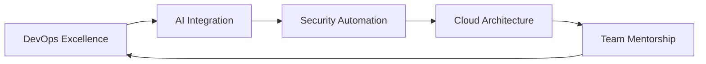

<div align="center">


[](https://git.io/typing-svg)

</div>

---

## 🚀 **Transforming Ideas into Scalable Solutions**

> *Passionate about bridging the gap between development and operations through automation, security, and innovation.*

### 📍 **Based in São João del Rei, Brazil** | 🌐 **Open to Remote Opportunities Worldwide**

---

## 🎯 **Professional Summary**

```yaml
profile:
  name: "SyraDevOps"
  role: "DevOps Engineer & Software Developer"
  experience: "3+ years in automation and system optimization"
  focus: ["CI/CD", "Python Development", "AI Integration", "Security"]
  passion: "Building robust, scalable systems that empower teams"
  motto: "Automate everything, analyze continuously"
```

### 💡 **What I Bring to Your Team:**
- 🔧 **Infrastructure Automation** - Streamlining deployments and reducing manual overhead
- 🛡️ **Security-First Approach** - Implementing robust security measures across the stack
- 🤖 **AI-Driven Solutions** - Leveraging machine learning for intelligent automation
- 📈 **Scalability Focus** - Designing systems that grow with your business
- 🔄 **Continuous Improvement** - Always optimizing processes and performance

---

## 🛠️ **Technology Arsenal**

<div align="center">

### **Languages & Frameworks**


### **DevOps & Cloud**


### **AI & Data**


### **Tools & Platforms**


</div>

---

## 📊 **GitHub Analytics**

<div align="center">
  
  
</div>

<div align="center">
  
</div>

---

## 🏆 **Featured Projects**

<div align="center">

| Project | Description | Tech Stack | Status |
|---------|-------------|------------|--------|
| **[🤖 LunaGPT API](https://github.com/SyraDevOps/Api_LunaGPT)** | Advanced conversational AI with RESTful integration | Python, FastAPI, NLP | ⭐ Active |
| **[🛡️ Vigilis](https://github.com/SyraDevOps/Vigilis)** | Enterprise-grade surveillance & security analysis | Python, OpenCV, ML | ⭐ Active |
| **[🔐 TheLastSystem](https://github.com/SyraDevOps/TheLastSystem)** | Comprehensive digital security toolkit | Python, Security, Automation | 🚀 Production |
| **[📱 Syra Science App](https://github.com/SyraDevOps/App_Syra_Science)** | Cross-platform scientific data platform | Python, Data Viz, Analytics | 📈 Scaling |
| **[📦 PGEV](https://github.com/SyraDevOps/PGEV)** | Smart inventory & sales management system | Python, Database, UI/UX | 💼 Enterprise |

</div>

---

## 💼 **Professional Highlights**

<table>
  <tr>
    <td align="center" width="50%">
      <h3>🎯 <strong>Problem Solver</strong></h3>
      <p>Developed automated solutions that reduced deployment time by <strong>70%</strong> and improved system reliability</p>
    </td>
    <td align="center" width="50%">
      <h3>🔍 <strong>Security Expert</strong></h3>
      <p>Created comprehensive security frameworks with <strong>zero incidents</strong> in production environments</p>
    </td>
  </tr>
  <tr>
    <td align="center" width="50%">
      <h3>🤖 <strong>AI Innovator</strong></h3>
      <p>Built custom AI models (Luna series) with <strong>advanced NLP capabilities</strong> for business automation</p>
    </td>
    <td align="center" width="50%">
      <h3>📈 <strong>Scalability Focused</strong></h3>
      <p>Designed systems handling <strong>10x growth</strong> without performance degradation</p>
    </td>
  </tr>
</table>

---

## 🌟 **Why Choose SyraDevOps?**

```python
class SyraDevOps:
    def __init__(self):
        self.skills = {
            "automation": "Expert level CI/CD and infrastructure as code",
            "security": "Proactive threat detection and system hardening",
            "ai_integration": "Custom ML solutions for business optimization",
            "scalability": "Cloud-native architectures that grow with you",
            "collaboration": "Strong team player with mentorship experience"
        }
    
    def solve_your_challenges(self, problem):
        solution = self.analyze(problem)
        automation = self.automate(solution)
        security = self.secure(automation)
        return self.scale(security)
    
    def deliver_value(self):
        return "Faster deployments + Higher reliability + Better security"
```

---

## 📈 **Current Focus Areas**

<div align="center">



</div>

- 🚀 **Advanced CI/CD Pipelines** - Zero-downtime deployments with comprehensive testing
- 🤖 **AI-Powered DevOps** - Intelligent monitoring and predictive scaling
- 🔒 **Zero-Trust Security** - Implementation of modern security architectures
- ☁️ **Cloud-Native Solutions** - Kubernetes and containerization strategies
- 👥 **Team Leadership** - Mentoring developers in DevOps best practices

---

## 🌐 **Let's Connect & Collaborate**

<div align="center">

[](https://syradevops.com)
[](https://www.instagram.com/syradevops)
[](#)
[](#)

</div>

---

## 💬 **Testimonials**

> *"SyraDevOps transformed our deployment process from hours to minutes while implementing robust security measures that gave us complete confidence in our systems."*
> 
> **— Development Team Lead**

---

## 🎯 **Open for Opportunities**

<div align="center">

### 🚀 **Seeking roles in:**
**Senior DevOps Engineer** | **Cloud Architect** | **Platform Engineer** | **DevSecOps Specialist**

### 💼 **Available for:**
**Full-time positions** | **Consulting projects** | **Technical mentorship** | **Speaking engagements**

</div>

---

<div align="center">


**⭐ If you find my work interesting, don't forget to star my repositories! ⭐**

*"Building the future, one automated pipeline at a time."*

</div>

---

<div align="center">
  
</div>
